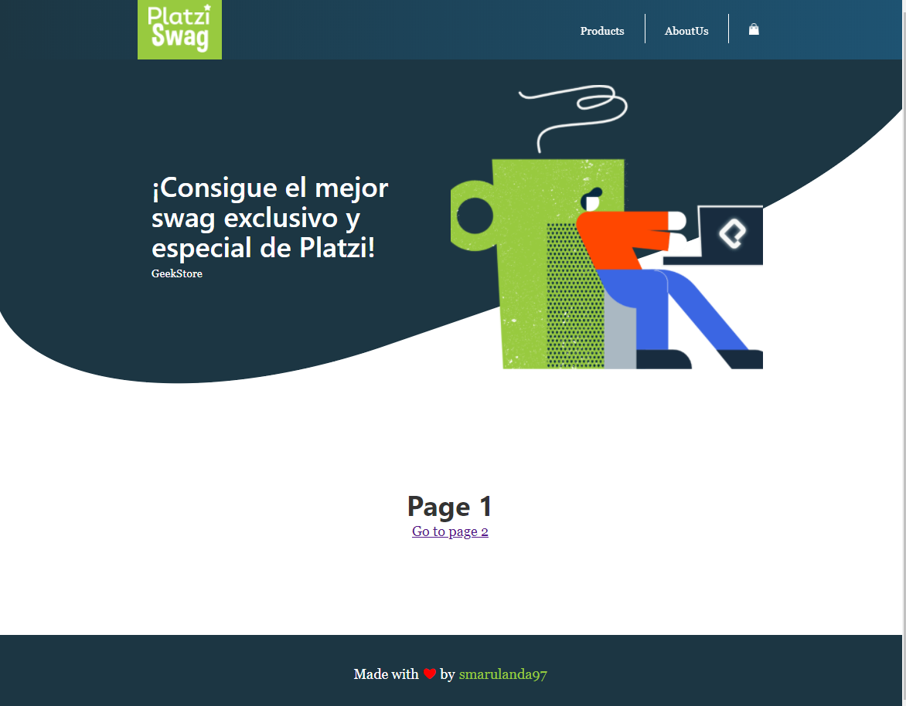

# GEEKSTORE

This project is my practice of the course "Web development with Gatsby" at Platzi. Actually is in development, but you can take pieces of this code how reference for your projects.

Feel free to contribute with this project, make corrections and teach your good development practices.

## IMPORTANT
- Required Node.js >= 12

## LIBRARIES

* Gatsby
* React
* React Helmet
* Styled Components
* Webpack
* Babel
* Prettier

## INSTALLATION PROCESS

* `npm install -g gatsby-cli` Install Gatsby-cli
* `npm install` Install project dependencies
* `gatsby develop` Start development server
* `gatsby build` Create production build

## LICENCE 

MIT
